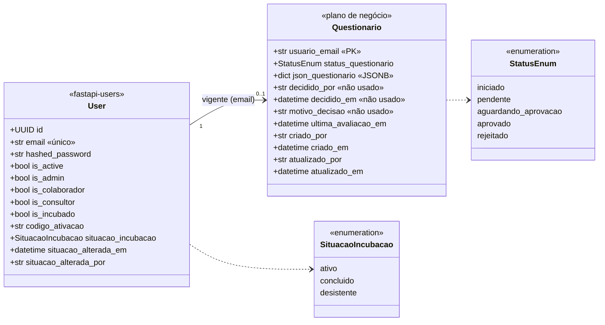
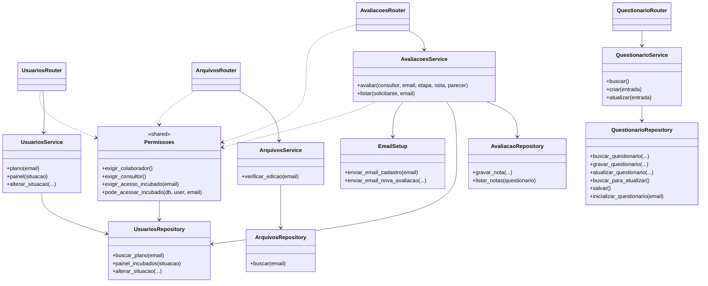

# Diagrama de classes — Gestão de Incubação

Renderiza no GitHub/GitLab e no VS Code (extensão Mermaid). Reflete o código em `src/`.

## 1. Domínio (models persistidos e estruturas do JSON)

## 2. Camadas (router → service → repository)

